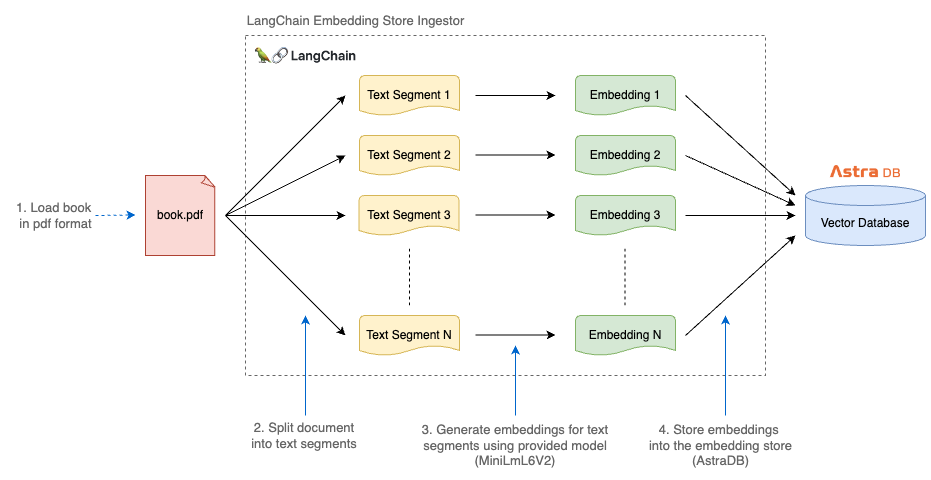
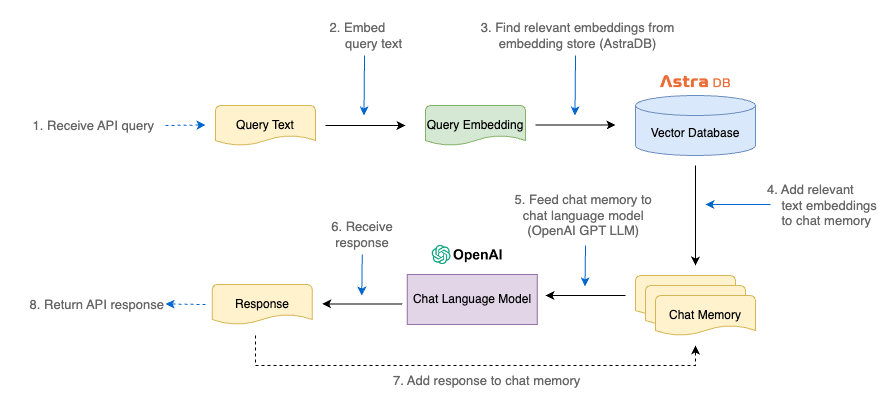

# AI Book Chat (Springboot, LangChain4j, AstraDB)

## Overview

Upload a book in PDF format and ask questions through REST API.

## Terminology

- Embedding (a.k.a. vector): numeric representation of real-world objects (like text, images, or videos). Simply a format similar to a list of cordinates that machine learning models can easily process.
- Embedding model: AI model that converts real-world objects into numeric representation. e.g. For text: LLMs like Open AI GPT-3, GPT-4
- Embedding store (a.k.a. vector database): used for efficient storage and retrieval of embeddings. e.g. AstraDB (based on Apache Cassandra)

## Architecture

Transform book text into embeddings and store on vector database.

Retrieve relevant text embeddings for queries from vector database, feed them to chat language model, and receive responses.

## Tech Stack

- Java 21
- **Springboot** 3.2.3: Java web application framework.
- Maven 3.9.6: Java dependency manager and build tool.
- Lombok: Java annotation library to reduce boilerplate code.
- **LangChain4j** 0.25: Java implementation of LangChain framework. Used to build LLM-based application functionalities.
- **AstraDB**: Serverless DBaaS built on Apache Cassandra. Used as the embedding store (a.k.a vector database).
- **Open AI** GPT LLM: Chat language model. Used to feed embeddings from vector DB to GPT LLM and get responses for queries.

## Initial Setup

Generate a fresh project with Springboot Web dependency (https://start.spring.io/).

    cd chat-api
    mvn -N wrapper:wrapper -Dmaven=3.9.6

Create Serverless Vector DB instance on AstraDB (https://astra.datastax.com/).

    DB Name: vector-db-1
    Provider: AWS
    Region: us-east-1
    CQL Table: vectordb
    Namespace: ai_book_chat

Create API Key from OpenAI (https://platform.openai.com/api-keys).

Set required environment variables.

    export ASTRA_DB_ID="XXXXX"
    export ASTRA_DB_TOKEN="AstraCS:XXXXXXX"
    export ASTRA_DB_REGION="us-east-1"
    export ASTRA_DB_NAMESPACE="ai_book_chat"
    export ASTRA_DB_TABLE="vectordb"
    export OPENAI_API_KEY="XXXXX"

Build and run application.

    ./mvnw clean install
    ./mvnw spring-boot:run

Test REST endpoint via a tool like Postman or `curl`.

    curl --location 'http://localhost:8080/api/chat' --header 'Content-Type: application/json' --data 'What is Cassandra?'

